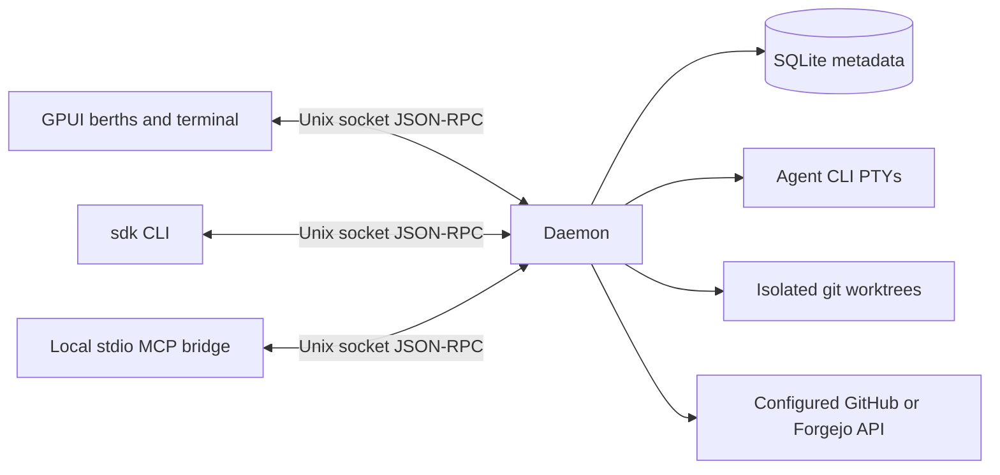

# Architecture

SigmaDock uses a native GPUI client and a daemon that owns agent processes. The UI can close without affecting workers. A thin CLI and a stdio MCP bridge use the same local protocol.

| Crate | Responsibility |
|---|---|
| `sigmadock-core` | Domain types, pure status derivation, bounded JSON-RPC client/framing |
| `sigmadock-store` | SQLite schema version, project/worker persistence and recovery markers |
| `sigmadock-pty` | PTY input, output replay, process status, resize and notification detection |
| `sigmadock-git` | Worktree creation, safe removal, prune and diff summaries |
| `sigmadock-forge` | Forge trait, GitHub and Forgejo REST facts and inline review comments |
| `sigmadock-agents` | Thin harness command/environment adapters |
| `sigmadock-ports` | Worker port leases |
| `sigmadock-mcp` | Local orchestrator tools via stdio MCP |
| `sigmadockd` | Session supervision, persistence, facts polling and socket API |
| `sigmadock-terminal` | Alacritty-backed GPUI terminal with live appearance and cursor controls |
| `sigmadock-ui` | GPUI project sidebar, berths view and `sigmadock-terminal` backed by Alacritty |
| `sigmadock-cli` | `sdk` CLI with raw-terminal attach |

## IPC version 2

A request is one UTF-8 JSON-RPC 2.0 object followed by a newline, with a maximum 4 MiB frame. One request per Unix connection. `ping` returns API version 2. UI snapshots, the CLI and MCP tool calls verify that version before using the daemon. Finish sessions and restart an older daemon with the matching installation before connecting. Errors contain a code and a local human-readable message; notifications get no response. A future incompatible API must bump the version and add negotiation.

Methods: `add_project`, `list_projects`, `remove_project`, `capacity`, `set_max_workers`, `list_queue`, `cancel_queued`, `retry_queued`, `spawn_worker`, `resume_worker`, `list_workers`, `get_worker_status`, `list_unfinished`, `session_context`, `clear_session_context`, `input`, `output`, `resize`, `message_worker`, `stop_worker`, `archive_worker`, `diff`, `prune`, `configure_forge`, `refresh_facts`, `review_feedback`, `ci_preview`, `ci_feedback`, `send_ci_feedback`, `configure_feedback`, `conflict_instruction`, `start_orchestrator`, `read_planning_notes`, `write_planning_notes`. Worker methods use `worker_id`; creation uses `project_id`, `title`, `agent`, optional `prompt` and `base`. See the CLI source for request shapes. `capacity` returns `max_workers`, `in_use`, `queued`, `per_project` counts and the `live` worker IDs in stable berth order; `list_workers` accepts `include_archived`, and archived workers carry `archived_at`. Terminal bytes are JSON arrays of integers; `output` uses an absolute byte cursor and returns up to 64 KiB per call. Transport uses read/write deadlines and limits concurrent connections to 32.

## Lifecycle and recovery

Create a project from a canonical git repository path. Spawn allocates a UUID branch/worktree and port, starts the harness in a PTY, then persists worker metadata. Failures roll back clean worktrees where possible. Runtime sessions remain in daemon memory; a wait thread reaps each child. The output ring is bounded; a bounded plain-text recovery tail is stored in SQLite. Session facts are persisted when they change.

The database is versioned (`user_version=4`) and rejects future versions. At daemon startup, formerly live workers become `lost`. A process lock prevents multiple daemons using one state directory. Cleanup refuses dirty worktrees and preserves branches even after archive, so unmerged commits remain recoverable. Automatic branch deletion is intentionally absent.

The forge poller does network work outside the daemon state lock. Fetch failures preserve last observed facts but add a visible blocker. Session state and exit code remain owned by the PTY supervisor. Poll intervals grow on errors. There are no webhooks or public TCP listeners.

## Native terminal

The terminal component receives a reader and writer connected to RPC, rather than spawning its own child. Resize updates the daemon-owned PTY. The GPUI component delegates escape sequence parsing to `alacritty_terminal`; SigmaDock does not implement a terminal emulator. Terminal component limitations, input latency and agent compatibility require manual qualification before release.

## Decisions

SigmaDock name; Apache-2.0; daemon/UI split; GPUI pinned at 0.2.2; a local terminal component derived from `gpui-terminal` 0.1.0; synchronous `rusqlite`; local newline JSON-RPC; GitHub.com plus Forgejo; Linux/macOS targets. The project uses sigmadock.dev. Crates are published by the release workflow; distribution packaging is pending.

Recovery checkpoints retain at most 16 KiB per worker, seven days and 512 entries. Checkpoint state is historical, separate from current runtime state. Resuming a worker that was marked lost requires an explicit acknowledgement of unknown process state; known live sessions refuse resume. Clearing context moves its in-memory capture boundary so earlier output is not written back on the next checkpoint. See [session recovery](RECOVERY.md).

Rich CI preview pins queries to a PR or branch head, returns check/status/workflow/job entries with bounded details, and rechecks the head before returning. Native refresh retains its timestamp and marks results stale if the inspected head differs from the latest provider or worker facts. Optional unsupported endpoints produce warnings instead of inventing results. It reuses configured forge clients/ETags and does not change PTY ownership.

The `output` RPC includes additive `cols` and `rows` fields containing the session's current PTY dimensions, including empty output responses. Berth previews resize their headless terminal before processing each response. Older daemons omit these fields; previews retain their last known size (initially 120×30). Output replay is a byte log, not a screen snapshot: historical bytes are not tagged with past geometry, so a newly attached preview relies on the agent's next redraw after earlier resizes.

## Berths and waiting tasks

A berth belongs to a live worker session. Exited sessions release capacity immediately; their last `berth` remains in worker history for a preferred slot on resume. New sessions take the lowest free slot. Lowering capacity keeps running sessions and their slot numbers intact; no new workers start until the live count is below the new limit. `max_workers` is 1–255. `set_max_workers` persists the setting, while an explicit startup `--max-workers` overrides it for that daemon run. Orchestrators use no berth and retain their separate allowance of one unarchived orchestrator per project.

`spawn_worker` with `queue: true` starts immediately when capacity is available and no tasks are waiting. Otherwise it stores a typed task and returns `{queued: true, id, position}`. `list_queue` returns FIFO order, global positions and any `last_error`; an optional `project_id` filters results without renumbering positions. Responses omit prompts and forge configuration and are limited to 100 tasks per page (`offset`, `limit`); the CLI fetches all pages. `cancel_queued` accepts `id`. CLI equivalents are `sdk spawn ... --queue`, `sdk queue`, and `sdk queue cancel ID`. Project-scoped MCP exposes only that project's queue and verifies scope on cancellation. Spawning, including queued spawning, still requires `--allow-spawn`.

Tasks retain their title, harness, prompt, base ref, forge configuration (environment variable names, never tokens) and usage preference. The default base ref is `main`, then `master`, then `HEAD`. The ref is resolved when work starts, so queued worktrees include intervening commits. No worktree, branch, port or PTY is created while waiting. The daemon starts tasks in global FIFO order within a local 200 ms supervision loop independent of forge network polling. A failed head task blocks the queue and remains visible instead of being dropped or retried repeatedly. Cancel it or inspect its files and processes, then use `sdk queue retry ID --acknowledge-unknown`.

A durable starting marker is committed before launch. Worker publication and queue consumption occur in one SQLite transaction; interrupted starts become visible queue errors on restart and are not relaunched automatically. The queue is limited to 1,000 tasks, titles to 4 KiB and prompts to 32 KiB. Queued prompts are local task data in the private state database. They are not sent to an agent until launch. Reordering is not implemented.

`remove_project` refuses projects with unarchived workers or waiting tasks. It hides an otherwise inactive project, retaining its repository, notes and archived history. Adding the repository again restores the same project ID. There is no force-delete mode. Native waiting-list and queued-count presentation remain tracked in #21.

## Local push events

`subscribe` opens a long-lived local JSON-RPC connection. The acknowledgement includes the current API version; subsequent notifications use `method: "event"` and a `params.type` discriminator: `resync`, `worker_changed`, `projects_changed`, `capacity_changed`, `queue_changed`, `output_available`, or `heartbeat`. Output notifications carry a worker ID, replay cursor, rows, columns and completion flag, never terminal bytes. Initial connection and reconnect require a full snapshot and replay catch-up; snapshots and `output` remain authoritative. Existing CLI/MCP RPCs are unchanged.

The daemon detects changes during its 200 ms supervision tick. Each subscriber has a bounded 64-event queue; overflow disconnects that subscriber so it reconnects and resyncs. Socket writes happen outside the daemon lock, time out after two seconds, and idle streams receive a heartbeat every two seconds. Subscriptions share the existing 32-connection cap.

The UI coalesces invalidations and preview reads at 750 ms intervals, fetching output only for notified workers, newly discovered berths, or a full resync. A 30-second fallback refresh catches missed recovery-context changes. The full terminal waits for notifications for its selected worker, with a 30-second catch-up timeout; disconnected subscriptions fall back to 750 ms reads while reconnecting. Lost wakeups are prevented by recording the notification generation before each output request. Resize and final PTY EOF also invalidate output even when the cursor does not advance.

Run `python3 scripts/events_smoke.py` after `cargo build` to verify subscriptions, geometry, restart resync and a six-shell-worker idle RPC schedule comparison. The benchmark reproduces the old/new client schedules without launching GPUI; heartbeat frames are reported separately from RPC calls, and the slow resync has an amortized cost.

Observed schedule benchmark on macOS with six idle shell workers and one open terminal: 46 RPC/s before, 0 RPC/s during a three-second subscription sample. The 30-second snapshot, preview and terminal catch-up adds approximately 0.4 RPC/s amortized; idle heartbeat notifications are about 0.5 frames/s on one persistent connection. These numbers describe the headless schedule reproduction, not a native UI profile.
