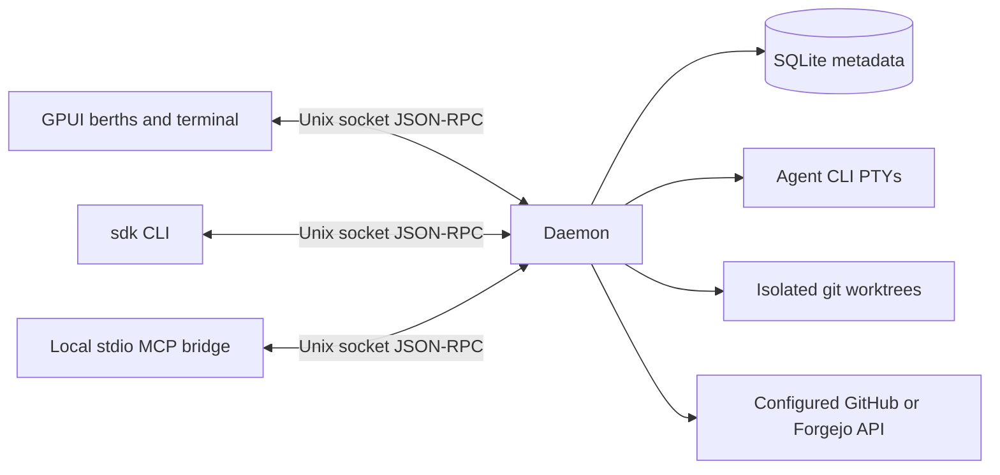

# Architecture

SigmaDock uses a native GPUI client and a daemon that owns agent processes. The UI can close without affecting workers. A thin CLI and a stdio MCP bridge use the same local protocol.

| Crate | Responsibility |
|---|---|
| `sigmadock-core` | Domain types, pure status derivation, bounded JSON-RPC client/framing |
| `sigmadock-store` | SQLite schema version, project/worker persistence and recovery markers |
| `sigmadock-pty` | PTY input, output replay, process status, resize and notification detection |
| `sigmadock-git` | Worktree creation, safe removal, prune and bounded diff snapshots |
| `sigmadock-forge` | Forge trait, GitHub and Forgejo REST facts and inline review comments |
| `sigmadock-agents` | Thin harness command/environment adapters |
| `sigmadock-ports` | Worker port leases |
| `sigmadock-mcp` | Local orchestrator tools via stdio MCP |
| `sigmadockd` | Session supervision, persistence, facts polling and socket API |
| `sigmadock-terminal` | Alacritty-backed GPUI terminal with live appearance and cursor controls |
| `sigmadock-ui` | GPUI project sidebar, berths view and `sigmadock-terminal` backed by Alacritty |
| `sigmadock-cli` | `sdk` CLI with raw-terminal attach |

## IPC version 2

A request is one UTF-8 JSON-RPC 2.0 object followed by a newline, with a maximum 4 MiB frame. One request per Unix connection, except the persistent `subscribe` event stream. `ping` returns API version 2. UI snapshots, the CLI and MCP tool calls verify that version before using the daemon. Finish sessions and restart an older daemon with the matching installation before connecting. Errors contain a code and a local human-readable message; notifications get no response. A future incompatible API must bump the version and add negotiation.

Methods: `worker_checks`, `subscribe`, `add_project`, `configure_project`, `list_projects`, `remove_project`, `capacity`, `set_max_workers`, `list_queue`, `cancel_queued`, `retry_queued`, `spawn_worker`, `resume_worker`, `list_workers`, `get_worker_status`, `list_unfinished`, `session_context`, `clear_session_context`, `input`, `output`, `resize`, `message_worker`, `stop_worker`, `archive_worker`, `diff`, `diff_patch`, `prune`, `configure_forge`, `refresh_facts`, `inbox`, `review_feedback`, `ci_preview`, `ci_feedback`, `send_ci_feedback`, `configure_feedback`, `conflict_instruction`, `start_orchestrator`, `read_planning_notes`, `write_planning_notes`. Worker methods use `worker_id`; creation uses `project_id`, `title`, `agent`, optional `prompt` and `base`. See the CLI source for request shapes. `capacity` returns `max_workers`, `in_use`, `queued`, `per_project` counts and the `live` worker IDs in stable berth order; `list_workers` accepts `include_archived`, and archived workers carry `archived_at`. Terminal bytes are JSON arrays of integers; `output` uses an absolute byte cursor and returns up to 64 KiB per call. `configure_project_forge` sets or clears a project's forge (`ForgeConfig`, whose `token` is `env` or `github_cli`) and applies it to the project's non-archived workers; new workers inherit it. `check_forge` returns the token's `login`, and `detect_forge` suggests a config from the `origin` remote. `diff_patch` returns a `DiffReport` (base ref, merge base, head, committed/uncommitted/untracked file sections, content identities, patches, warnings and truncation) plus compatibility `text`. Workers record the selected base ref at creation; symbolic HEAD and commit expressions freeze to a commit ID. Older records use the configured project base or detected origin default; missing bases return an error rather than an empty HEAD diff. Patches are captured with bounded subprocess output: 100 file entries, 64 KiB per file and 256 KiB overall. `diff` formats the report as text, or summaries with `stat: true`. The UI stores viewed identities per worker/section/file in an atomic, permission-0600 `viewed-diffs.json` beside its preferences, retaining at most 4096 markers. Changed identities and incomplete patches reset the checkbox. `inbox` returns open issues assigned to, and pull requests requesting review from, each configured forge token's user, plus per-repository `warnings`. GitHub assignments are read account-wide once per API URL and token (`GET /issues?filter=assigned`), so they include repositories without a worker; Forgejo assignments and all review requests are read per configured repository; results are cached for 60 seconds unless `refresh` is true, and forge calls run outside the daemon lock. Transport uses read/write deadlines and limits concurrent connections to 32.
## Lifecycle and recovery

Create a project from a canonical git repository path. Spawn allocates a UUID branch/worktree and port, starts the harness in a PTY, then persists worker metadata. Failures roll back clean worktrees where possible. Runtime sessions remain in daemon memory; a wait thread reaps each child. The output ring is bounded; a bounded plain-text recovery tail is stored in SQLite. Session facts are persisted when they change.

The database is versioned (`user_version=4`) and rejects future versions. At daemon startup, formerly live workers become `lost`. A process lock prevents multiple daemons using one state directory. Cleanup refuses dirty worktrees and preserves branches even after archive, so unmerged commits remain recoverable. Automatic branch deletion is intentionally absent.

The forge poller does network work outside the daemon state lock. Fetch failures preserve last observed facts but add a visible blocker. Session state and exit code remain owned by the PTY supervisor. Poll intervals grow on errors. There are no webhooks or public TCP listeners.

## Native terminal

The terminal component receives a reader and writer connected to RPC, rather than spawning its own child. Resize updates the daemon-owned PTY. The GPUI component delegates escape sequence parsing to `alacritty_terminal`; SigmaDock does not implement a terminal emulator. Terminal component limitations, input latency and agent compatibility require manual qualification before release.

## Decisions

SigmaDock name; Apache-2.0; daemon/UI split; GPUI pinned at 0.2.2; a local terminal component derived from `gpui-terminal` 0.1.0; synchronous `rusqlite`; local newline JSON-RPC; GitHub.com plus Forgejo; Linux/macOS targets. The project uses sigmadock.dev. Crates are published by the release workflow; distribution packaging is pending.

Recovery checkpoints retain at most 16 KiB per worker, seven days and 512 entries. Checkpoint state is historical, separate from current runtime state. Resuming a worker that was marked lost requires an explicit acknowledgement of unknown process state; known live sessions refuse resume. Clearing context moves its in-memory capture boundary so earlier output is not written back on the next checkpoint. See [session recovery](RECOVERY.md).

Rich CI preview pins queries to a PR or branch head, returns check/status/workflow/job entries with bounded details, and rechecks the head before returning. Native refresh retains its timestamp and marks results stale if the inspected head differs from the latest provider or worker facts. Optional unsupported endpoints produce warnings instead of inventing results. It reuses configured forge clients/ETags and does not change PTY ownership.

The `output` RPC includes additive `cols` and `rows` fields containing the session's current PTY dimensions, including empty output responses. Berth previews resize their headless terminal before processing each response. Older daemons omit these fields; previews retain their last known size (initially 120×30). Output replay is a byte log, not a screen snapshot: historical bytes are not tagged with past geometry, so a newly attached preview relies on the agent's next redraw after earlier resizes.

## Berths and waiting tasks

A berth belongs to a live worker session. Exited sessions release capacity immediately; their last `berth` remains in worker history for a preferred slot on resume. New sessions take the lowest free slot. Lowering capacity keeps running sessions and their slot numbers intact; no new workers start until the live count is below the new limit. `max_workers` is 1–255. `set_max_workers` persists the setting, while an explicit startup `--max-workers` overrides it for that daemon run. Orchestrators use no berth and retain their separate allowance of one unarchived orchestrator per project.

`spawn_worker` with `queue: true` starts immediately when capacity is available and no tasks are waiting. Otherwise it stores a typed task and returns `{queued: true, id, position}`. `list_queue` returns FIFO order, global positions and any `last_error`; an optional `project_id` filters results without renumbering positions. Responses omit prompts and forge configuration and are limited to 100 tasks per page (`offset`, `limit`); the CLI fetches all pages. `cancel_queued` accepts `id`. CLI equivalents are `sdk spawn ... --queue`, `sdk queue`, and `sdk queue cancel ID`. Project-scoped MCP exposes only that project's queue and verifies scope on cancellation. Spawning, including queued spawning, still requires `--allow-spawn`.

Tasks retain their title, harness, prompt, base ref, forge configuration (environment variable names, never tokens) and usage preference. Projects store a `base_branch` detected from `refs/remotes/origin/HEAD`, editable with `configure_project` (`project_id`, `base_branch`) or `sdk project-base`. Default tasks record this branch and `fetch_base: true`; launch fetches its explicit refspec into `refs/remotes/origin/<branch>` with an eight-second timeout and branches from the resolved commit. Failed fetches use the cached remote commit and persist a visible `base_warning` on the worker; missing cached commits fail creation. Explicit `base` refs skip fetching and are resolved when work starts. Legacy queued records retain their recorded ref as an explicit override. Local branches, the index and source working files are never updated. No worktree, branch, port or PTY is created while waiting. The daemon starts tasks in global FIFO order within a local 200 ms supervision loop independent of forge network polling. A failed head task blocks the queue and remains visible instead of being dropped or retried repeatedly. Cancel it or inspect its files and processes, then use `sdk queue retry ID --acknowledge-unknown`.

A durable starting marker is committed before launch. Worker publication and queue consumption occur in one SQLite transaction; interrupted starts become visible queue errors on restart and are not relaunched automatically. The queue is limited to 1,000 tasks, titles to 4 KiB and prompts to 32 KiB. Queued prompts are local task data in the private state database. They are not sent to an agent until launch. Reordering is not implemented.

`remove_project` refuses projects with unarchived workers or waiting tasks. It hides an otherwise inactive project, retaining its repository, notes and archived history. Adding the repository again restores the same project ID. There is no force-delete mode. Native waiting-list and queued-count presentation remain tracked in #21.

## Daemon events

`subscribe` replies with the daemon API version and keeps the Unix connection open for JSON-RPC `event` notifications. Each subscription starts with `resync`, then emits `worker_changed`, `projects_changed`, `capacity_changed`, `queue_changed` and `output_available` notifications. Output events carry the worker ID, absolute cursor, dimensions, EOF flag and session generation; terminal bytes stay behind the existing `output` RPC. The local 200 ms supervisor detects changes independently of forge network requests. Polling RPCs continue to work for CLI/MCP callers.

The UI shares one subscription across its workspace, previews and open terminal. Workspace changes are coalesced locally and trigger a snapshot refresh; a 30-second resync repairs missed state. Previews fetch only notified or newly attached sessions, with the existing 750 ms cap. The open terminal waits for its own worker's output events and drains available chunks without idle socket polling. A session generation change resets replay, and reconnect begins with a fresh snapshot and previews. If subscriptions are unavailable, the terminal uses a 250 ms polling fallback and previews retain their existing polling interval.

Subscriber queues are bounded to 64 events, with at most 16 subscriptions within the existing 32-connection limit. Fanout never blocks on client I/O under the daemon lock. A lagging subscriber is disconnected and reconnects/resyncs; writes have deadlines. Five-second heartbeats detect idle peer disconnects. UI disposal shuts down its socket to interrupt a blocked reader.

`scripts/events_smoke.py` runs a real daemon with six shell workers and compares a headless RPC workload following the previous snapshot/preview/open-terminal intervals against event-driven selective fetching. On the development Mac, the two approximately six-second windows measured about 35.8 RPC/s (215 requests) versus 0 RPC/s (0 requests). The 30-second five-request resync contributes approximately 0.17 RPC/s outside the measured idle window. This measures the observer workload, not a rendered GUI or CPU usage; interactive terminal latency still requires visual qualification.

## Proposed macOS menu bar supervision

The pre-implementation [menu bar investigation](MENU_BAR.md) for #36 compares native adapters, recommends application-owned supervision, and defines attention/notification qualification. It does not describe an implemented capability.

## Advisory worker checks

`worker_checks` returns a typed `ReadinessReport` with the worker's observed facts, local `GitReadiness`, `CiPreview`, `ReviewPreview`, and independent per-section errors. It does not refresh forge facts or fetch Git refs. Detail requests use the existing forge adapter on demand and run outside the daemon lock; no periodic polling is added. Local comparisons prefer the observed PR target branch, then the configured project branch. An observed PR HEAD matching local HEAD confirms a push even when the cached worker tracking ref is missing.

The shared readiness model orders Git, PR, CI, review and conflict blockers. Known blockers take precedence over unknowns, and all data must be complete and commit-consistent for Ready. `CiPreview.complete` is false on missing/malformed provider endpoints; informational log-download warnings do not turn passing results into failures. Readiness does not authorize merging or establish protected-branch compliance.

Review previews exclude resolved comments and sort the remaining comments by file/line. GitHub reads bounded, paginated review threads on demand through [its GraphQL review-thread API](https://docs.github.com/en/graphql/reference/pulls#pullrequestreviewthread); Forgejo reads each review's comments and [resolver field](https://codeberg.org/forgejo/forgejo/src/branch/forgejo/modules/structs/pull_review.go). Missing resolution metadata, incomplete threads and provider errors stay unknown. Comment bodies and feedback are bounded and sanitized as untrusted task data.

The UI uses the existing `ci_feedback`/`send_ci_feedback`, `review_feedback` message formatting, `conflict_instruction` and `message_worker` paths. An optional `expected_text` makes CI delivery reject changed feedback rather than sending text the user did not preview. Optional `expected_git_head` and `expected_pr_head` on `message_worker` reject stale checks-pane previews. Request generations prevent late detail responses from replacing another worker's pane. CLI and MCP calls without these optional guards keep their existing behavior.
