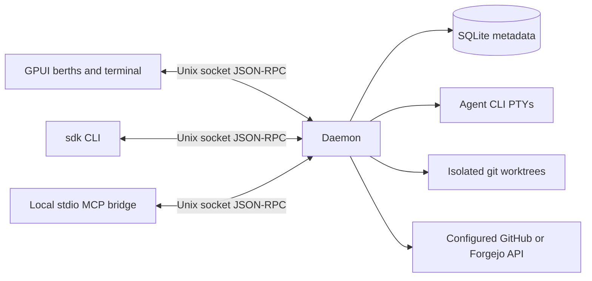

# Architecture

SigmaDock uses a native GPUI client and a daemon that owns agent processes. The UI can close without affecting workers. A thin CLI and a stdio MCP bridge use the same local protocol.

| Crate | Responsibility |
|---|---|
| `sigmadock-core` | Domain types, pure column derivation, bounded JSON-RPC client/framing |
| `sigmadock-store` | SQLite schema version, project/worker persistence and recovery markers |
| `sigmadock-pty` | PTY input, output replay, process status, resize and notification detection |
| `sigmadock-git` | Worktree creation, safe removal, prune and diff summaries |
| `sigmadock-forge` | Forge trait, GitHub and Forgejo REST facts and inline review comments |
| `sigmadock-agents` | Thin harness command/environment adapters |
| `sigmadock-ports` | Worker port leases |
| `sigmadock-mcp` | Local orchestrator tools via stdio MCP |
| `sigmadockd` | Session supervision, persistence, facts polling and socket API |
| `sigmadock-terminal` | Alacritty-backed GPUI terminal with live appearance and cursor controls |
| `sigmadock-ui` | GPUI project sidebar, berths view and `sigmadock-terminal` backed by Alacritty |
| `sigmadock-cli` | `sdk` CLI with raw-terminal attach |

## IPC version 1

A request is one UTF-8 JSON-RPC 2.0 object followed by a newline, with a maximum 4 MiB frame. One request per Unix connection. `ping` returns API version 1. Errors contain a code and a local human-readable message; notifications get no response. A future incompatible API must bump the version and add negotiation.

Methods: `add_project`, `list_projects`, `capacity`, `spawn_worker`, `resume_worker`, `list_workers`, `get_worker_status`, `list_unfinished`, `session_context`, `clear_session_context`, `input`, `output`, `resize`, `message_worker`, `stop_worker`, `archive_worker`, `diff`, `prune`, `configure_forge`, `refresh_facts`, `review_feedback`, `ci_preview`, `ci_feedback`, `send_ci_feedback`, `configure_feedback`, `conflict_instruction`, `start_orchestrator`, `read_planning_notes`, `write_planning_notes`. Worker methods use `worker_id`; creation uses `project_id`, `title`, `agent`, optional `prompt` and `base`. See the CLI source for request shapes. `capacity` returns `max_workers` and the `live` worker ids that hold a berth, oldest first; `list_workers` accepts `include_archived`, and archived workers carry `archived_at`. Terminal bytes are JSON arrays of integers; `output` uses an absolute byte cursor and returns up to 64 KiB per call. Transport uses read/write deadlines and limits concurrent connections to 32.

## Lifecycle and recovery

Create a project from a canonical git repository path. Spawn allocates a UUID branch/worktree and port, starts the harness in a PTY, then persists worker metadata. Failures roll back clean worktrees where possible. Runtime sessions remain in daemon memory; a wait thread reaps each child. The output ring is bounded; a bounded plain-text recovery tail is stored in SQLite. Session facts are persisted when they change.

The database is versioned (`user_version=3`) and rejects future versions. At daemon startup, formerly live workers become `lost`. A process lock prevents multiple daemons using one state directory. Cleanup refuses dirty worktrees and preserves branches even after archive, so unmerged commits remain recoverable. Automatic branch deletion is intentionally absent.

The forge poller does network work outside the daemon state lock. Fetch failures preserve last observed facts but add a visible blocker. Session state and exit code remain owned by the PTY supervisor. Poll intervals grow on errors. There are no webhooks or public TCP listeners.

## Native terminal

The terminal component receives a reader and writer connected to RPC, rather than spawning its own child. Resize updates the daemon-owned PTY. The GPUI component delegates escape sequence parsing to `alacritty_terminal`; SigmaDock does not implement a terminal emulator. Terminal component limitations, input latency and agent compatibility require manual qualification before release.

## Decisions

SigmaDock name; Apache-2.0; daemon/UI split; GPUI pinned at 0.2.2; a local terminal component derived from `gpui-terminal` 0.1.0; synchronous `rusqlite`; local newline JSON-RPC; GitHub.com plus Forgejo; Linux/macOS targets. The project uses sigmadock.dev. Crates are published by the release workflow; distribution packaging is pending.

Recovery checkpoints retain at most 16 KiB per worker, seven days and 512 entries. Checkpoint state is historical, separate from current runtime state. Resuming a worker that was marked lost requires an explicit acknowledgement of unknown process state; known live sessions refuse resume. Clearing context moves its in-memory capture boundary so earlier output is not written back on the next checkpoint. See [session recovery](RECOVERY.md).

Rich CI preview pins queries to a PR or branch head, returns check/status/workflow/job entries with bounded details, and rechecks the head before returning. Native refresh retains its timestamp and marks results stale if the inspected head differs from the latest provider or worker facts. Optional unsupported endpoints produce warnings instead of inventing results. It reuses configured forge clients/ETags and does not change PTY ownership.

The `output` RPC includes additive `cols` and `rows` fields containing the session's current PTY dimensions, including empty output responses. Berth previews resize their headless terminal before processing each response. Older daemons omit these fields; previews retain their last known size (initially 120×30). Output replay is a byte log, not a screen snapshot: historical bytes are not tagged with past geometry, so a newly attached preview relies on the agent's next redraw after earlier resizes.
